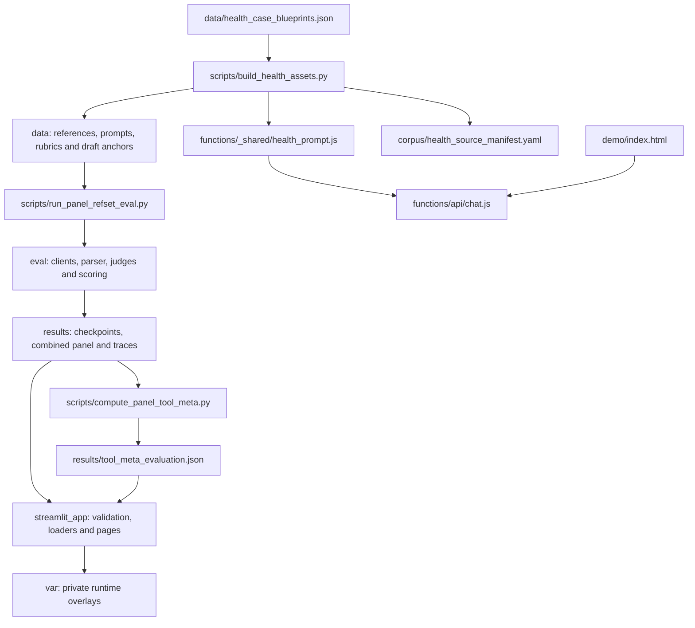

# Architecture and repository layout

[Documentation](../README.md) · [Methodology](../methodology/evaluation.md)

HealthEval has a file-based evaluation pipeline and a review interface. The
workbench consumes saved evidence; it does not silently regenerate a missing run.
Live tools make explicit provider calls and keep their method distinct from the
saved benchmark.

## Directory responsibilities

| Location | Responsibility | Editing guidance |
|---|---|---|
| `data/` | Authored case blueprints, generated benchmark assets and Pydantic input schemas. | Edit blueprints/generator first. `schemas.py` is code; YAML and JSON are versioned inputs. |
| `corpus/` | Source provenance and reference publications. | Retain source attribution and separate third-party rights. Downloads go to ignored cache. |
| `eval/` | Provider clients, judging, final-method policy, metric/statistical helpers and framework adapters. | Keep scoring and parsing testable without API access. |
| `scripts/` | CLI orchestration, generation, aggregation and maintenance. | Entry points resolve the repo root; use explicit output directories. |
| `streamlit_app/` | Configuration, loaders, evidence validation, components and nine pages. | Keep UI behavior separate from core scoring decisions. |
| `functions/`, `demo/` | Optional Pages response API and browser UI. | The Worker uses the generated prompt but does not run independent judges. |
| `tests/` | `smoke/`, `integration/`, `workbench/` and `worker/` suites. | One default pytest discovery path; Worker tests use Node. |
| `results/` | Published model evidence and labeled historical diagnostics. | Never substitute fixtures for measurements. Experiments go to ignored `results/runs/`. |
| `var/` | Local budgets, imported reviews and QA outputs. | Ignored, writable state; never part of published evidence or the image. |
| `docs/` | Guides, methodology, reference, research, validation and screenshots. | Link from `docs/README.md`; keep evidence dates and scope explicit. |
| `.github/` | CI, dependency update policy and contribution templates. | Pin actions and keep offline checks credential-free. |

Root manifests are deliberate: uv, npm, Docker, Compose, Wrangler and Promptfoo
all have discoverable entry points there. Python dependencies have one manifest
and lockfile. The workbench has one Dockerfile; `Dockerfile.promptfoo` packages
only the optional evaluation tool. A fake installable Python library would hide
the application's dependency on versioned repository assets, so uv treats this
checkout as an application with `package = false`.

## Evidence boundary

The benchmark fingerprint hashes **relative filenames and bytes** of the
reference set, system prompt, constitution, calibration examples and rubric YAMLs.
Those paths stay stable so a folder cleanup does not invalidate measured evidence.
The hash does not cover every line of application code; record the Git revision
and generation settings as well when comparing runs.

Per-model checkpoints are written atomically. A combined artifact records the
selected models and actual jury. The workbench chooses completed evidence for the
current fingerprint and validates it before rendering dependent pages. Optional
comparators remain unavailable until their matching results exist.

Tests write mocked end-to-end outputs to temporary directories. Repository checks
rebuild generated inputs in a separate temporary directory, compare their bytes,
and reject stale evidence. Production process health is checked separately from
benchmark validity, provider access and clinical interpretation.

## Configuration and operating boundary

Local `.env` values are loaded before workbench configuration, while injected
process values take precedence. Runtime state is separate from published results.
The container runs immutable application files as a non-root user and writes only
to mounted state or temporary storage in the supplied Compose profile.

Authentication, durable multi-user review storage, enforceable billing limits and
clinical validation are not included subsystems. The
[operations guide](../guides/deployment.md) describes the integration points and
required decisions before public or patient-facing use.
